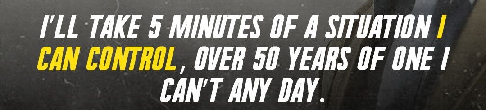

</a>

<h3 align="center">
Hi there, I'm Naor 👋
</h3>

<h2 align="center">
I'm Electrical and Computer Engineer 💻!
</h2> 
🤝 Connect with me: 
 
- 💬 If you have any question/feedback, please do not hesitate to reach out to me!

## 💼 Technical Skills

 

# 🤔 I’m looking for help with finding a job as a developer 
# ⚡ Fun fact: I watched Prison break 5 times

## 📈 GitHub Stats 

<!--
**naorJR/naorJR** is a ✨ _special_ ✨ repository because its `README.md` (this file) appears on your GitHub profile.

Here are some ideas to get you started:

- 🔭 I’m currently working on 
- 🌱 I’m currently learning ...
- 👯 I’m looking to collaborate on ...
- 🤔 I’m looking for help with ...
- 💬 Ask me about ...
- 📫 How to reach me: ...
- 😄 Pronouns: ...
- ⚡ Fun fact: ...
-->

